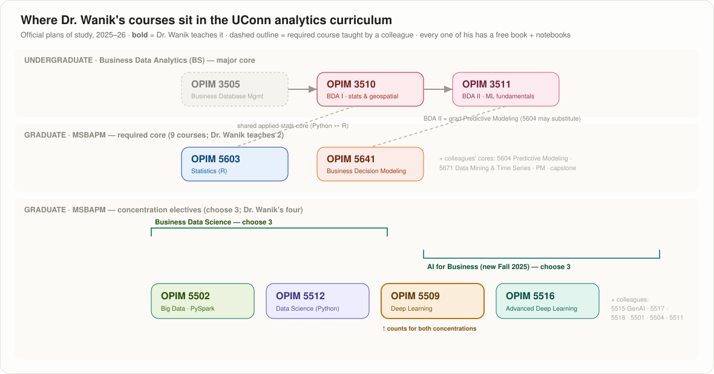

# OPIM Skills Atlas — Dr. Dave Wanik (UConn)

A cross-course map of **what students learn** across the whole OPIM analytics curriculum — undergraduate and graduate — with each skill paired with its **theory**, its **real-world implementation**, and **how to practice it**:

> ✋ **by hand** (math/manual) · 💻 **local code** (a notebook) · ☁️ **production** (deployed in the cloud)

*Companion to the 8 course textbooks (`opim####-textbook`) and notebook repos (`OPIM####-notebooks`).*

---

## The learning pathways

Dr. Wanik's eight courses anchor two UConn programs (2025–26 plans of study):

- **Undergraduate — Business Data Analytics (BS) core:** OPIM 3505 *Database* → [**3510**](OPIM3510.md) *BDA I: Data Storytelling, Applied Stats & Geospatial* → [**3511**](OPIM3511.md) *BDA II: ML Fundamentals* — he teaches **3510 & 3511** (and **3802** *Data & Text Analytics* as a School-of-Business elective).
- **Graduate — MSBAPM required core:** of the 9 required courses he teaches **2** — [**5603**](OPIM5603.md) *Statistics in Business Analytics (R)* and [**5641**](OPIM5641.md) *Business Decision Modeling*.
- **Graduate — concentration electives:** his other four anchor **both** data-focused concentrations — **Business Data Science** ([5502](OPIM5502.md) · [5509](OPIM5509.md) · [5512](OPIM5512.md)) and **AI for Business** (new Fall 2025: [5509](OPIM5509.md) · [5516](OPIM5516.md)) — with **5509 counting toward both**.

Two **shared cores** stitch the programs together: **3510 ↔ 5603** teach the same applied statistics (Python vs. R), and **BDA II (3511) ≈ the graduate Predictive-Modeling core** — officially, OPIM 5604 may substitute for 3511 — so a strong undergraduate arrives in the MS already owning the modeling foundation, ready for the production, cloud, and deep-learning work layered on top in 5512/5509/5516.

---

## The skill matrix — who teaches what, and how

Cell shows **how you practice** each skill in that course: ✋ by hand · 💻 in a notebook · ☁️ in production. Blank = not covered.

| Skill | 3510 | 3511 | 5603 | 5512 | 5509 | 5516 | 5502 | 5641 |
|---|:--:|:--:|:--:|:--:|:--:|:--:|:--:|:--:|
| **Python & programming** | ✋💻 | ✋💻 | ✋💻† | 💻 | 💻 | 💻 | ✋💻 | ✋💻 |
| **EDA & data wrangling** | 💻 | 💻 | 💻† | 💻 | 💻 | | 💻 | |
| **Data cleaning (dirty data)** | 💻 | 💻 | | 💻 | | | 💻 | |
| **Joins, merge & SQL** | ✋💻 | 💻 | | | | | ✋💻 | |
| **Applied stats — sampling · CLT · CIs** | ✋💻 | | ✋💻 | ✋💻 | | | | |
| **Probability & simulation** | ✋💻 | | ✋💻 | | | | | ✋💻 |
| **Statistical inference — tests · MLE** | | | ✋💻 | | | | | |
| **Regression & GLMs** | | ✋💻 | ✋💻 | 💻 | | | | 💻 |
| **The ML recipe — split·scale·fit·eval** | | ✋💻 | | ✋💻 | ✋💻 | 💻 | 💻 | |
| **Classification & error metrics** | | ✋💻 | | ✋💻 | 💻 | | 💻 | |
| **Trees, forests & boosting** | | ✋💻 | | 💻 | | | | |
| **Imbalanced data & SMOTE** | | ✋💻 | | 💻 | | | | |
| **Model interpretation (xAI)** | | ✋💻 | | ✋💻 | | ✋💻 | | |
| **Pipelines · CV · tuning · AutoML** | | 💻 | | 💻 | 💻 | | 💻 | |
| **Deep learning — DNN/CNN/RNN** | | | | ✋💻 | ✋💻 | 💻 | | |
| **Advanced DL — Bayesian·GNN·Transformers** | | | | | | ✋💻 | | |
| **Time series & forecasting** | ✋💻 | | | 💻 | 💻 | 💻 | | ✋💻 |
| **Text & NLP** | | | | 💻 | 💻 | 💻 | 💻 | |
| **Geospatial & mapping** | ✋💻 | | | | | | | |
| **Big data / distributed (PySpark)** | | | | | | | ✋💻 | |
| **Cloud, production & Git/CI** | | | | ☁️💻 | | ☁️💻 | ☁️💻 | |
| **Optimization & decision modeling** | | | | | | | | ✋💻 |

† 5603 is taught in **R**; every other course is Python.

---

## 🔗 The shared core — the spine of the whole curriculum

A handful of skills recur in *most* courses. They're the highest-leverage things to drill, because mastering them once pays off in every class and on the job:

1. **Python + pandas fluency** — read, wrangle, join, describe. Everything sits on this (undergrad 3510/3511 build it; every grad course assumes it).
2. **The ML methodology** — read → split → **scale-on-train** → fit → **evaluate** with the right metrics. Identical in 3511, 5512, 5509, 5516, and 5502 (just in MLlib). *Leakage discipline* is the single most transferable habit.
3. **Honest evaluation** — confusion matrix, precision/recall/F1, R²/MAE/RMSE, and **confidence via repetition** (CV, bootstrap). Rooted in 5603/3510 statistics, applied everywhere.
4. **Model interpretation** — permutation importance & PDPs are model-agnostic, so the *same* tool explains a tree (3511), a boosted model (5512), or a deep net via SHAP (5516).
5. **"By hand, then code"** — Dr. Wanik's pedagogical signature: derive the split, the backprop step, the Simplex pivot, the likelihood — *then* call the library. It's why the ✋ column is so full.

> Everything else is course-specific *theory* — transformers, SMOTE, window functions, shadow prices. The shared core is the **spine**; the specializations are the ribs.

---

## 🪜 The three-rung ladder (✋ → 💻 → ☁️)

Every skill is taught to be *practiced*, and the curriculum deliberately climbs three rungs:

- **✋ by hand** — the math on paper (a decision-tree split, a backprop step, a confidence interval, a Simplex tableau). Builds the intuition that makes the library make sense.
- **💻 local code** — a notebook you run (sklearn, Keras, Pyomo, PySpark). Where most of the coursework lives.
- **☁️ production** — deployed, scheduled, in the cloud. Concentrated in **5512** (GCP + GitHub Actions), **5516** (GCP data pipelines), and **5502** (Databricks/HPC).

**The growth edge:** production (☁️) is the thinnest rung. The identical *deploy-on-a-schedule* pattern from 5512's web-scraping module would let a 5509 deep-learning model or a 5641 portfolio optimizer become "deploy it" exercises too — a reusable GCP + Actions template is the highest-value thing to build next.

---

## 🔬 From classroom to research

The skills aren't abstract — they're the toolkit behind Dr. Wanik's own research in **machine learning for natural-hazard resilience** ([Google Scholar](https://scholar.google.com/citations?user=xyW8xncAAAAJ)):

| Research theme | Courses that build it |
|---|---|
| **Storm-outage forecasting** for utilities | time series (3510/5512) · trees & boosting (3511/5512) · geospatial (3510) |
| **Weather-impact & remote sensing** (LiDAR, GRIB/NetCDF) | geospatial (3510) · big data (5502) · deep learning (5509/5516) |
| **Energy analytics & spatiotemporal forecasting** | time series → transformers (5512 → 5516) · optimization (5641) |
| **Uncertainty quantification** | statistics/MLE (5603) · Bayesian nets (5516) |

The **5516 spatiotemporal-forecasting project** is, essentially, a student-scale version of the storm-outage research.

---

## 🧩 Where to grow the atlas

| Mode | Gap | To build |
|---|---|---|
| ✋ **by hand** | most ✋ skills lack a standalone worksheet | a "by-hand pack" per track (TF-IDF, backprop step, a CI, a Simplex pivot, a tree split) |
| ☁️ **production** | only 3 courses reach the cloud | one **reusable GCP + GitHub-Actions template** so *any* model becomes a deploy exercise |
| 🔁 **cross-links** | undergrad→grad bridges are implicit | an explicit "if you took 3511, here's what 5512 adds" onboarding note |

---

*Course roles reflect the official 2025–26 plans of study ([MSBAPM curriculum](https://catalog.uconn.edu/graduate/degree-programs/business-analytics-project-management-ms/) · [BDA BS](https://catalog.uconn.edu/undergraduate/business/bda-bs/)). Skill content is built from the course learning objectives, textbook chapters, per-lecture key points, and notebook repos. One atlas per course: [3510](OPIM3510.md) · [3511](OPIM3511.md) · [5502](OPIM5502.md) · [5509](OPIM5509.md) · [5512](OPIM5512.md) · [5516](OPIM5516.md) · [5603](OPIM5603.md) · [5641](OPIM5641.md).*
